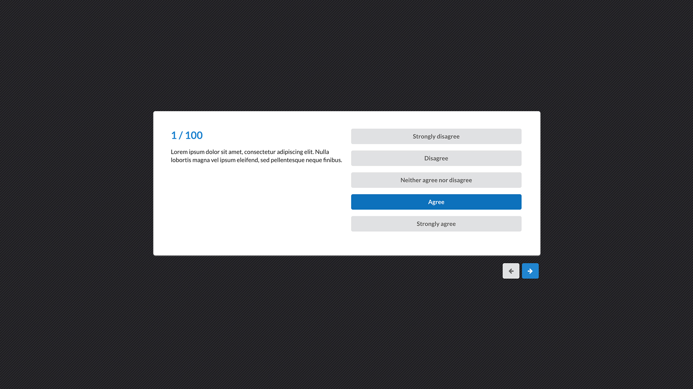

# Simple Survey

This project consists in a simple HTML / CSS template to create a survey.
The idea is to create a web-based survey app which can be used securely in a company.

The data are loaded from a JSON file `/data/example.json` and the code is stored into `/js/load.js`.

I'm using a simple jQuery `getJSON()` call to load the values from the `example.json` file:

```javascript
$.getJSON('../data/example.json', function (data) {

  [...]

});
```

The most of the features should come in the future days.

### Structure
```
.
├── README.md
├── css
│   ├── loginStyle.css
│   └── surveyStyle.css
├── data
│   └── example.json
├── img
│   ├── meeting_edit.jpg
│   ├── mockup1.jpg
│   └── mockup2.jpg
├── index.html
├── js
│   ├── load.js
│   └── script.js
└── login.html
```
### To DO
- Authentication system
- Credential cryptography
- Support to DB
- A lot more!


### Screens
Below two screens of the main pages of the survey.
#### Login Page

#### Main Page

